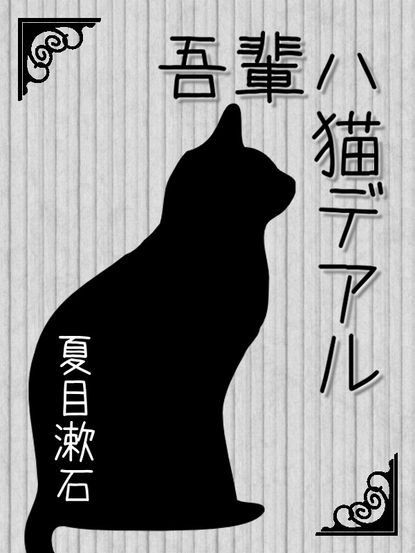

# はじめに

このページでは初めて LaTeX を使う人を対象に、簡単な LaTeX 文書（sample01.tex と sample02.tex）を作りながらチュートリアル形式で文書づくりの基礎（コンパイル方法など）と注意点を説明しています。

# 提案

わがはいは猫である。名前はまだ無い。
　どこで生れたかとんと見当けんとうがつかぬ。何でも薄暗いじめじめした所でニャーニャー泣いていた事だけは記憶している。吾輩はここで始めて人間というものを見た。しかもあとで聞くとそれは書生という人間中で一番獰悪どうあくな種族であったそうだ。この書生というのは時々我々を捕つかまえて煮にて食うという話である。しかしその当時は何という考もなかったから別段恐しいとも思わなかった。ただ彼の掌てのひらに載せられてスーと持ち上げられた時何だかフワフワした感じがあったばかりである。掌の上で少し落ちついて書生の顔を見たのがいわゆる人間というものの見始みはじめであろう。この時妙なものだと思った感じが今でも残っている。第一毛をもって装飾されべきはずの顔がつるつるしてまるで薬缶やかんだ。その後ご猫にもだいぶ逢あったがこんな片輪かたわには一度も出会でくわした事がない。のみならず顔の真中があまりに突起している。そうしてその穴の中から時々ぷうぷうと煙けむりを吹く。どうも咽むせぽくて実に弱った。これが人間の飲む煙草たばこというものである事はようやくこの頃知った。
　この書生の掌の裏うちでしばらくはよい心持に坐っておったが、しばらくすると非常な速力で運転し始めた。書生が動くのか自分だけが動くのか分らないが無暗むやみに眼が廻る。胸が悪くなる。到底とうてい助からないと思っていると、どさりと音がして眼から火が出た。それまでは記憶しているがあとは何の事やらいくら考え出そうとしても分らない。
　ふと気が付いて見ると書生はいない。たくさんおった兄弟が一疋ぴきも見えぬ。肝心かんじんの母親さえ姿を隠してしまった。その上今いままでの所とは違って無暗むやみに明るい。眼を明いていられぬくらいだ。はてな何でも容子ようすがおかしいと、のそのそ這はい出して見ると非常に痛い。吾輩は藁わらの上から急に笹原の中へ棄てられたのである。

# システム実装

# まとめ

もうよそう。勝手にするがいい。がりがりはこれぎりご免蒙めんこうむるよ」と、前足も、後足も、頭も尾も自然の力に任せて抵抗しない事にした。
　次第に楽になってくる。苦しいのだかありがたいのだか見当がつかない。水の中にいるのだか、座敷の上にいるのだか、判然しない。どこにどうしていても差支さしつかえはない。ただ楽である。否いな楽そのものすらも感じ得ない。日月じつげつを切り落し、天地を粉韲ふんせいして不可思議の太平に入る。吾輩は死ぬ。死んでこの太平を得る。太平は死ななければ得られぬ。南無阿弥陀仏なむあみだぶつ南無阿弥陀仏。ありがたいありがたい。

